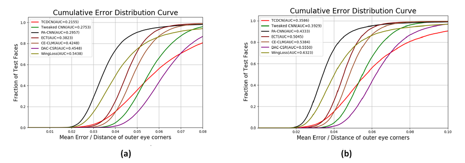

# Facial landmark detection evaluation on MOBIO face image data
This repositry contains the code used for facial landmark detection, and performance evaluation.

# Link
[[Report]](https://arxiv.org/abs/2307.03329)

# Abstract
* Performed facial landmark detection evaluation on face images extracted from multi-modual audio-visual face video database MOBIO.
* Manually labelled 20,600 face images with 22 landmarks as the groundtruth using a self-developed facial point labelling tool.
* Seven state-of-the-art facial landmark detection methods (Tweaked CNN, WingLoss, DAC-CSR, PA-CNN, OpenPose, ECT, and TCDCN) are adopted to evaluate their performance on the data.
* Conducted a thorough analysis and comparison to show that MOBIO is challenging for facial landmark detection.

# MOBIO
* The mobile biometrics database, MOBIO, is an audio-visual database captured almost exclusively using mobile phones.
* It is taken from 152 persons with 100 males and 52 females, and collected from August 2008 until July 2010 in six different sites from five different countries with both native and non-native English speakers.
* This mobile phone database consists of over 61 hours of audio-visual data with 12 distinct sessions usually separated by several weeks.
* One special point is that the acquisition device is given to the user, rather than being in a fixed position, which makes this database unique
and now being used in an interactive and uncontrolled manner.
* The MOBIO database provides a challenging test-bed for face verification, speaker verification, and bi-modal verification.

# Common types of facial points
Fig. shows several common types of facial landmarks with (a) 5, (b) 6, (c) 16, (d) 19, (e) 21, (f) 22, (g) 29, (h) 49, (i) 68 points.

# Some examples of annotated face points on commonly used Databases

# Facial points labelling tool

# Evaluation Algorithms
Choose several facial landmark detection methods to perform face alignment task and analyze their performance on the mobile still faces and other commonly used face databases like 300W, AFW, AFLW, COFW.
* Tweaked CNN
* PA-CNN Model
* WingLoss
* CE-CLM
* ECT
* TCDCN
* DAC-CSR

Among these deep learning methods, Tweaked CNN detects 5 facial points, WingLoss and DAC-CSR detect 19 points, and the others detect 68 points. 

Some methods of them can do facial landmark detection directly on face images with any sizes. 

Tweaked CNN, WingLoss and ECT need face cropping with size of 256*256 before facial landmark detection. 

MTCNN is adopted in our work to do face detection and cropping due to its efficiency.

# Metrics
Normalized mean error (NME), Cumulative Error Distribution curve (CED), Area Under the error Curve (AUC) and failure rate are adopted as our measure metrics for evaluation.

# Result

